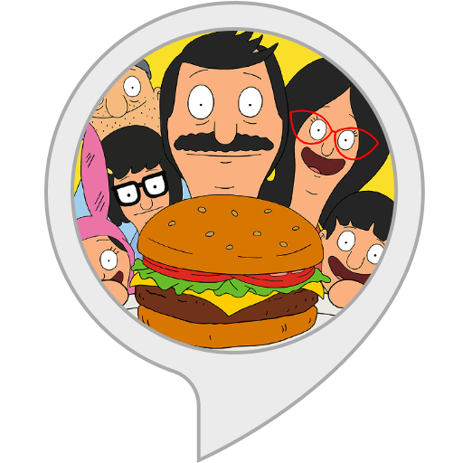

# Bob's Burger (http://bobsburgerapp.herokuapp.com/)

A full stack, MVC (Model-View-Controller) application that allows you to create burgers (POST), view a list of burgers available to eat (GET), devour burgers (PUT), and throw them away after devoured (DELETE).

###  How the app works
This project is a full stack application that allows you to place an order for a burger. When you place an order, the burger you enter in the form field is added to the list of burgers on the left side of the screen. Each burger in the list has a <b>Devour me</b> button. Clicking this button moves the burger from the list on the left side of the screen to the list on the right. The list on the right is a list of burgers that have already been devoured. Each burger in this list has a <b>Throw away</b> button that allows you to remove the burger, which deletes the burger from the user interface as well as from the MySQL database. 

###  How the app is built
This project uses MySQL, Node, Express, Handlebars, ORM (Object Relational Mapper). Node and MySQL are used to query and route data in the application. Express is the backend web framework used for this application, and Handlebars is a templating language that is used to generate the HTML.

###  MVC design pattern
This project also follows the MVC (Model-View-Controller) design pattern. The MVC design pattern assigns objects in the application one of three roles (model, view, or controller) and defines the way the different parts of the application communicate with one another.

  * <b>View object:</b>
  A view object is an object in the application that is visible (in the user interface) to the end user of the application. The view displays data from the application's model and learns about any changes to the model data via the controller. For example, in this application, the user enters a burger name in a text field. The view communicates the user input via the controller to the model.

  * <b>Controller object:</b>
  A controller object controls the flow of data between the view and the model (that is, the controller is an intermediary between the two). The controller interprets any user changes made in the view and communicates the changed data to the model. Also, if the model were to change, the controller is what communicates the updated data to the view so that the user can see the updated data in the user interface.

  * <b>Model object:</b>
  A model object manages the data. When data is created or changed by the user in the view (for example, a user devours or throws away a burger), that change is communicated via the controller to the model. Also, when data is created or changed in the model, the model communicates that change via the controller to the view, and the view displays the updated data to the user.

For more information about the MVC design pattern, check out the following resources:
  * https://en.wikipedia.org/wiki/Model%E2%80%93view%E2%80%93controller
  * https://docs.microsoft.com/en-us/aspnet/core/mvc/overview

##  Technologies used to build app
* [Backend technologies](#Backend)
* [Frontend technologies](#Frontend)

###  Backend technologies
* Node.js (https://nodejs.org/en/)
* MySQL (https://www.mysql.com/)
* Express (http://expressjs.com/)
* ORM - Object Relational Mapping (https://en.wikipedia.org/wiki/Object-relational_mapping)

###  Frontend technologies
* HTML
* CSS
* Bootstrap (http://getbootstrap.com/)
* Javascript
* jQuery (https://jquery.com/)
* Handlebars (http://handlebarsjs.com/)
